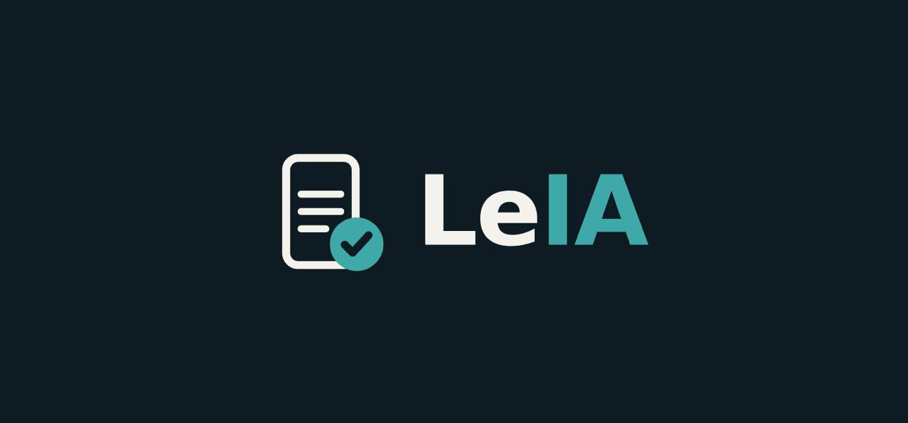

# LeIA



Consentimento esclarecido com prova. Equipe **Token Economy**, Hackathon da Cidadania OAB-PR 2026 (6ª edição),
categoria **Inovação Aberta e Cidadania**. Licença MIT. Publicado na pasta da equipe do repositório oficial da OAB/PR.

> Plataforma para o cidadão entender um documento jurídico antes de assinar, em ambiente seguro, com supervisão de
> advogado e registro auditável de que o esclarecimento ocorreu. Não substitui o advogado.

## O que faz
1. O documento (procuração, contrato de honorários ou acordo) entra na plataforma; a IA gera a explicação em linguagem simples, sempre com o trecho literal da cláusula; o advogado aprova antes de o cidadão ver.
2. O cidadão percorre o documento um tópico por vez, tira dúvidas e responde a perguntas abertas de compreensão, avaliadas por rubrica.
3. O advogado revisa as respostas e valida (supervisão humana).
4. O sistema gera o registro do consentimento (JSON canônico → SHA-256) e o ancora em registro público com carimbo de tempo; o comprovante do cidadão traz QR para verificação. Nenhum dado pessoal vai ao registro público.

## O que não faz
Não presta consultoria, não interpreta o caso concreto, não recomenda aceitar ou recusar, não substitui a assinatura do documento. Ver [docs/POSITIONING.md](docs/POSITIONING.md).

## Estado das entregas
Cada entrega é uma tag anotada no git; detalhes e comandos em [docs/DELIVERIES.md](docs/DELIVERIES.md) e [CHANGELOG.md](CHANGELOG.md).

| Entrega | Prazo | Tag | Estado |
|---|---|---|---|
| 1. Canvas | sáb 12h | `token-economy/v0.1.0` | entregue, ver [evidence/01-canvas](evidence/01-canvas/) |
| 2. V1 com testes internos | sáb 15h30 | `token-economy/v0.2.0` | V1 do serviço rodou no laptop do Carlos; escopo em [docs/MVP.md](docs/MVP.md) |
| 3. V2 com testes externos | sáb 17h30 | `token-economy/v0.3.0` | planejada |
| 4. Produto + auditoria | dom 10h30 | `token-economy/v0.4.0` | em construção: interface da cidadã, comprovante, verificação, mock, roteiro de auditoria |
| 5. Slides | dom 14h30 | `token-economy/v0.5.0` | planejada |
| Pitch | dom 16h30 | `token-economy/v1.0.0` | planejado |

## Estrutura
```
├── README.md, LICENSE, CHANGELOG.md (uma seção por entrega)
├── docs/          arquitetura, casos de uso, telas, contrato da API do serviço de LLM, MVP, roadmap, testes
├── prompts/       prompts do produto (versionados) e registro dos prompts usados na construção
├── evidence/      evidências de cada entrega e dos pontos extras
├── scripts/       tag-delivery.sh (fecha uma entrega: tag + changelog)
├── examples/      contrato de exemplo (fixture) para rodar sem o serviço
└── apps/          web (Next.js: interface do produto) e llm-service (FastAPI: serviço, registro, mock)
```

## Documentos
- [docs/POSITIONING.md](docs/POSITIONING.md): posicionamento, limites da IA, papel do advogado.
- [docs/ARCHITECTURE.md](docs/ARCHITECTURE.md): componentes, fluxo de dados, decisões.
- [docs/INTEGRATION-PLAN.md](docs/INTEGRATION-PLAN.md): stack e plano do dia 2, integração com o serviço.
- [docs/LLM-API-CONTRACT.md](docs/LLM-API-CONTRACT.md): contrato entre a interface e o serviço de LLM (FastAPI).
- [docs/LLM-WORKFLOW-REVIEW.md](docs/LLM-WORKFLOW-REVIEW.md): revisão do workflow do serviço (v0) e adaptação ao produto.
- [docs/USE-CASES.md](docs/USE-CASES.md) e [docs/SCREENS.md](docs/SCREENS.md): personas, casos de uso, diagramas de sequência e telas.
- [docs/SCALING.md](docs/SCALING.md): escala para 1, 100 e 1.000 usuários e custo por consentimento.
- [docs/MVP.md](docs/MVP.md) e [docs/ROADMAP.md](docs/ROADMAP.md): escopo por entrega e evolução.
- [docs/INTERNAL-TESTS.md](docs/INTERNAL-TESTS.md): plano e relatório dos testes internos (Entrega 2).
- [docs/CANVAS.md](docs/CANVAS.md): canvas da Entrega 1.
- [docs/brand/README.md](docs/brand/README.md): logo, paleta e contraste.
- [prompts/README.md](prompts/README.md): política de prompts.
- [docs/CONTRIBUTING.md](docs/CONTRIBUTING.md): como subir código, publicar na pasta oficial e fechar uma entrega.

## Demonstração hospedada
- App (cidadã): **https://leia-snowy.vercel.app** (Vercel, projeto `leia`).
- Serviço cognitivo: **https://llm-service-production-4278.up.railway.app** (Railway, projeto `leia`, serviço `llm-service`,
  volume em `/data`). O app aponta para ele por `NEXT_PUBLIC_API_BASE`; o painel do profissional é o `/login` do serviço.
- Toque em "Ver um exemplo": é uma tarefa real, processada pelo workflow a partir de
  [examples/contrato-honorarios-exemplo.pdf](examples/contrato-honorarios-exemplo.pdf) (contrato fictício).

## Como rodar
Dois processos: o serviço cognitivo (FastAPI) e o app (Next.js). Sem `NEXT_PUBLIC_API_BASE`, o app usa um mock interno
(`apps/web/app/api/*`) e roda sozinho, sem chave de modelo.
```bash
# 1. serviço (precisa de GROQ_API_KEY; sem ela, use o mock: uvicorn mock.app:app --port 8000)
cd apps/llm-service && python -m venv .venv && . .venv/bin/activate && pip install -r requirements.txt
cp .env.example .env   # preencha GROQ_API_KEY e ADMIN_PASSWORD
set -a; . ./.env; set +a; uvicorn main:app --port 8000      # painel em http://localhost:8000/login

# 2. app
cd apps/web && printf 'NEXT_PUBLIC_API_BASE=http://localhost:8000\n' > .env.local && pnpm install && pnpm dev   # http://localhost:3000
```
No painel, "Novo documento" com um PDF de texto; o link da cliente aponta para o app (`CLIENT_APP_URL`). Detalhes:
[apps/llm-service/README.md](apps/llm-service/README.md) e [apps/web/README.md](apps/web/README.md).
Auditoria: [docs/AUDIT-GUIDE.md](docs/AUDIT-GUIDE.md). Conferir um registro: `scripts/verify_cli.py registro.json <hash>`.
