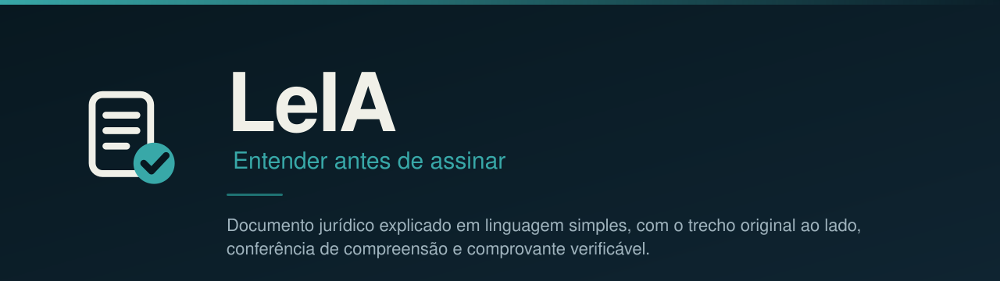

<!-- github-only:start -->
<p align="center">
  
</p>

<p align="center">
  <a href="https://leia-snowy.vercel.app"></a>
  <a href="https://github.com/deegalabs/leia/actions/workflows/ci.yml"></a>
  <a href="LICENSE"></a>
  
</p>

<p align="center">
  
  
  
  
  
  
  
  
  
  
  
</p>
<!-- github-only:end -->

# LeIA

**Entender antes de assinar.** LeIA pega o documento jurídico que a pessoa recebeu, explica em português simples
com o trecho original sempre ao lado, responde dúvidas apenas com o que está escrito ali, confere se ela entendeu
e emite um comprovante verificável desse entendimento. Um advogado revisa e libera antes de o link chegar ao cidadão.

> Hoje fica registrado que a pessoa recebeu o documento. Não fica registrado que ela entendeu.

A plataforma não presta consultoria, não interpreta o caso concreto e não substitui o advogado.
Os limites estão escritos em [docs/POSITIONING.md](docs/POSITIONING.md) e aparecem na própria interface.

## O que o sistema faz

1. **Entrada.** O documento entra pela conta do advogado ou pela conta do próprio cidadão. Um pipeline de 14 tarefas
   lê o PDF, separa as cláusulas e escreve a explicação, sempre com o trecho literal que a sustenta.
2. **Revisão humana.** Quando quem enviou é advogado, nada chega ao cidadão antes da aprovação dele.
3. **Leitura.** O cidadão percorre um tópico por vez, ouve o texto se quiser e pergunta o que não entendeu.
   A resposta cita o trecho; pergunta fora do documento recebe recusa explícita.
4. **Conferência.** Perguntas de compreensão com correção por rubrica, número de tentativas limitado,
   e ponto a rever quando erra.
5. **Comprovante.** JSON canônico, SHA-256 e carimbo de tempo por OpenTimestamps. O comprovante traz um QR
   para conferência por terceiro. Nenhum dado pessoal vai para o registro público.

## Demonstração

| O quê | Onde |
|---|---|
| Aplicação | https://leia-snowy.vercel.app |
| Documentação navegável | https://leia-snowy.vercel.app/docs |
| Serviço cognitivo | https://llm-service-production-4278.up.railway.app |

Em "Ver um exemplo" a jornada roda sobre uma tarefa real, processada pelo pipeline a partir de
[examples/contrato-honorarios-exemplo.pdf](examples/contrato-honorarios-exemplo.pdf), que é um contrato fictício.

## Arquitetura

```
apps/web            Next.js 16 · React 19 · Tailwind 4 · PWA instalável
  app/                telas da cidadã, painel do advogado, comprovante, verificação pública, docs
  components/         primitivas de interface e componentes de jornada
  lib/                cliente da API, markdown das docs, espelho do registro em TypeScript

apps/llm-service    FastAPI · SQLModel · Postgres · Groq (openai/gpt-oss-120b)
  leia/               API v3: contas, documentos, dúvidas, registro público e carimbo
  core/               banco, autenticação, tentativas, workspace, PDF do comprovante
  protocolo_pdf.json  pipeline declarativo de 14 tarefas
  mock/               serviço falso, roda a interface inteira sem chave de modelo
```

O navegador fala só com o app, e o app fala com o serviço. Quem faz a ponte são as rotas em `app/api/*`, que
encaminham para o endereço em `SERVICE_URL` ou respondem pelo mock interno quando não há serviço configurado.
É esse desenho que permite a sessão viver num cookie que script de página não alcança, porque cookie não
atravessa origens. O contrato entre os dois está em
[docs/API-V3-CONTRACT.md](docs/API-V3-CONTRACT.md); os diagramas de caso de uso e de sequência, em
[docs/USE-CASES.md](docs/USE-CASES.md); as decisões e o fluxo de dados, em [docs/ARCHITECTURE.md](docs/ARCHITECTURE.md).

## Como rodar

Pré-requisitos: Node 24 com pnpm 9, Python 3.12. Nada mais é obrigatório para ver a interface inteira.

### Só a interface, sem chave de modelo

```bash
git clone https://github.com/deegalabs/leia.git && cd leia/apps/web
pnpm install
pnpm dev                     # http://localhost:3000, usando o mock interno
```

### Sistema completo

```bash
# 1. serviço cognitivo
cd apps/llm-service
python3 -m venv .venv && . .venv/bin/activate
pip install -r requirements.txt
cp .env.example .env         # preencha GROQ_API_KEY e ADMIN_PASSWORD
set -a; . ./.env; set +a
uvicorn main:app --port 8000

# 2. aplicação, em outro terminal
cd apps/web
printf 'SERVICE_URL=http://localhost:8000\n' > .env.local
pnpm install && pnpm dev
```

Sem chave da Groq, troque o serviço pelo mock: `uvicorn mock.app:app --port 8000`.
Detalhes de cada lado em [apps/llm-service/README.md](apps/llm-service/README.md) e
[apps/web/README.md](apps/web/README.md).

### Testes

```bash
cd apps/llm-service && .venv/bin/python -m pytest -q
cd apps/llm-service && .venv/bin/python -m evals.run   # bateria de avaliação do motor
cd apps/web && pnpm test && pnpm lint && pnpm build
```

A bateria mede o que o motor promete, sobre casos gravados de tarefas reais, sem chave de modelo.
O que ela mede e o que ela deliberadamente não mede está em [apps/llm-service/evals/README.md](apps/llm-service/evals/README.md).

Os mesmos comandos rodam na integração contínua a cada pull request.

## Como contribuir

O caminho é sempre issue, branch, pull request. Ninguém escreve direto na `main`.

1. **Abra uma issue** com um dos modelos ([erro](.github/ISSUE_TEMPLATE/erro.yml),
   [melhoria](.github/ISSUE_TEMPLATE/melhoria.yml)) e espere a issue ser aceita antes de escrever código.
2. **Crie a branch** a partir da `main`, nomeada pelo tipo e pelo número da issue: `fix/123-nome-curto`,
   `feat/124-nome-curto`, `docs/125-nome-curto`.
3. **Escreva o teste antes da correção.** O teste precisa falhar por causa do problema, e só então o código muda.
   Um teste que já nasce passando não prova nada.
4. **Commits em inglês**, no padrão [Conventional Commits](https://www.conventionalcommits.org/pt-br/),
   escopo no nome do app: `fix(web): ...`, `feat(service): ...`, `docs: ...`.
5. **Abra o pull request** apontando a issue que ele fecha. A integração contínua roda sozinha e a Vercel publica
   uma prévia da aplicação.
6. **O merge exige uma aprovação** e a integração contínua verde. Depois do merge na `main`, a aplicação e o serviço
   sobem em produção automaticamente.

O guia completo, com a divisão de pastas e o que nunca entra no repositório, está em
[docs/CONTRIBUTING.md](docs/CONTRIBUTING.md).

### Regras que valem para todo mundo

- Interface e documentação em português simples, sem juridiquês e sem travessão. Código, identificadores e commits
  em inglês.
- Nenhum dado pessoal real em `examples/` ou `evidence/`. Chave de API nunca entra no repositório, só em variável
  de ambiente.
- Nenhuma afirmação sobre o documento sem o trecho literal que a sustenta.
- Arquivo gerado pela plataforma não carrega metadado de ferramenta.

## Configuração do repositório

| Item | Como está |
|---|---|
| Branch de produção | `main`, protegida: pull request obrigatório, uma aprovação, CI verde, sem force push |
| Integração contínua | [`.github/workflows/ci.yml`](.github/workflows/ci.yml), testes do serviço e do app em todo pull request |
| Aplicação | Vercel, projeto `leia`, diretório raiz `apps/web`, produção na `main`, prévia por pull request |
| Serviço | Railway, projeto `leia`, serviço `llm-service`, diretório raiz `apps/llm-service`, deploy na `main` |
| Sinal de vida | `GET /health` no serviço, é ele que autoriza a versão nova a assumir |
| Segredos | variáveis de ambiente nas duas plataformas, nunca no repositório, modelo em `.env.example` |

## Documentação

| Documento | Assunto |
|---|---|
| [docs/POSITIONING.md](docs/POSITIONING.md) | Posicionamento, limites da IA, papel do advogado |
| [docs/ARCHITECTURE.md](docs/ARCHITECTURE.md) | Componentes, fluxo de dados, decisões |
| [docs/USE-CASES.md](docs/USE-CASES.md) | Personas, casos de uso e diagramas de sequência |
| [docs/API-V3-CONTRACT.md](docs/API-V3-CONTRACT.md) | Contrato entre a aplicação e o serviço |
| [docs/SERVICE-V2-MAP.md](docs/SERVICE-V2-MAP.md) | Mapa do serviço: rotas, dados, workflow, variáveis |
| [docs/SCREENS.md](docs/SCREENS.md) | Telas e estados |
| [docs/AUDIT-GUIDE.md](docs/AUDIT-GUIDE.md) | Como auditar uma afirmação e conferir um registro |
| [docs/SCALING.md](docs/SCALING.md) | Escala para 1, 100 e 1.000 pessoas e custo por consentimento |
| [docs/ROADMAP.md](docs/ROADMAP.md) | Para onde o produto vai |
| [docs/STATUS.md](docs/STATUS.md) | O que está pronto e o que não está |
| [docs/brand/README.md](docs/brand/README.md) | Logo, paleta e contraste medido |
| [prompts/README.md](prompts/README.md) | Política de prompts do produto |

Conferir um registro sem depender do serviço: `scripts/verify_cli.py registro.json <hash>`.

## Origem e licença

Nasceu no Hackathon da Cidadania OAB-PR, 6ª edição, Curitiba, 12 e 13 de setembro de 2026, na categoria Inovação
Aberta e Cidadania. Mantido pela Deega Labs. Licença [MIT](LICENSE).
