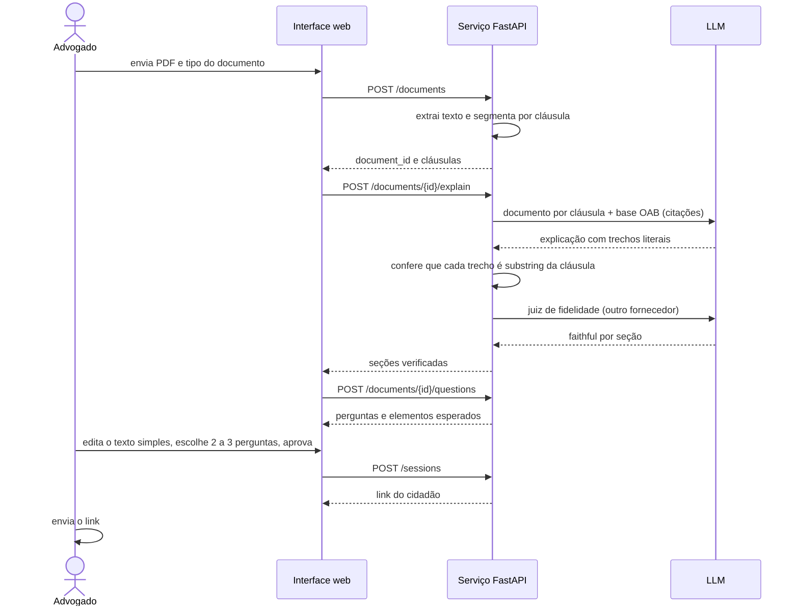
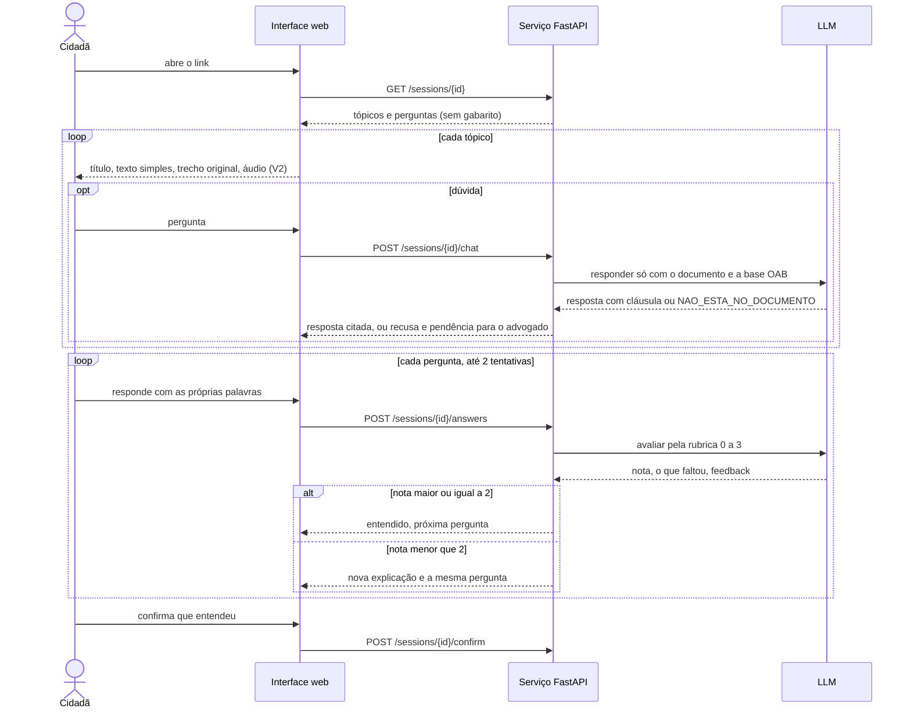
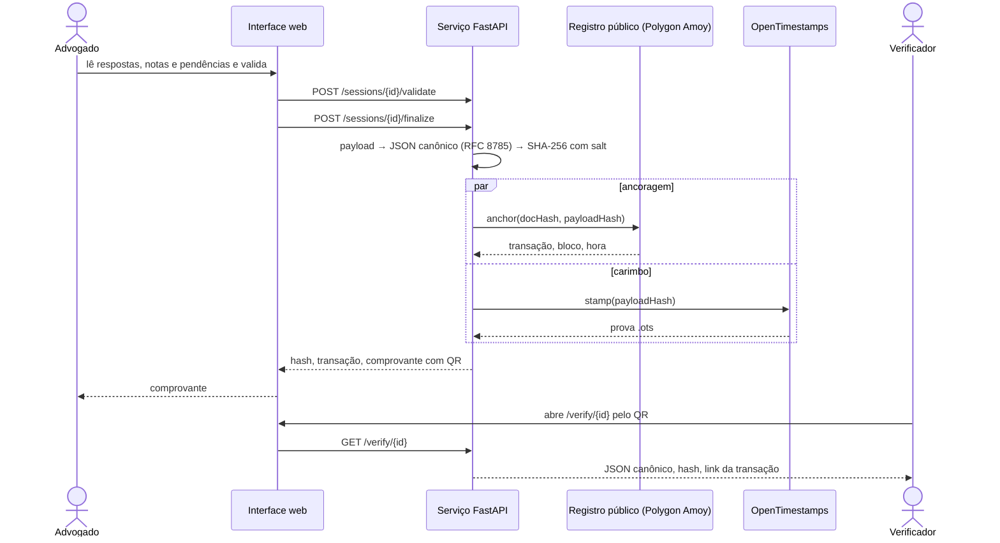

# Casos de uso

## Personas
| Persona | Quem é | O que precisa | Como mede sucesso |
|---|---|---|---|
| **Cidadã** (usuária principal) | pessoa que vai assinar procuração, contrato de honorários ou acordo; baixa escolaridade; celular básico; prefere ouvir a ler; hoje pesquisa no Google ou cola o documento e seus dados no ChatGPT; medo de golpe e de "assinar errado" | entender o documento antes de assinar, em ambiente seguro, com direito a perguntar, recusar e falar com o advogado | chega ao comprovante em menos de 4 minutos sem instrução; explica com as próprias palavras o que assina |
| **Advogado** (supervisão) | pequeno escritório, dativo, Defensoria, núcleo de prática; pouco tempo; dever de informar (CED art. 9º e 48) | aprovar a explicação, ver dúvidas e respostas, validar e receber a prova de que o esclarecimento ocorreu | pendências claras; registro gerado; nada dito pela IA sem trecho da cláusula |
| **Verificador** | auditor da OAB, juiz, a própria cidadã meses depois | conferir que o registro é íntegro e datado, sem depender do sistema | recalcula o hash e encontra a transação no registro público |

Atores: **Cidadão** (usuário principal; link com token, sem cadastro), **Advogado** (supervisão; login simples na PoC),
**Verificador** (qualquer pessoa com o QR), **Sistema** (interface + serviço de LLM).

| # | Caso de uso | Ator | Fluxo principal | Resultado | Entrega |
|---|---|---|---|---|---|
| UC-01 | Enviar documento | Advogado (V1) ou Cidadão (decisão pendente, ver POSITIONING.md) | escolhe o tipo, envia o PDF; sistema extrai cláusulas e gera explicação com citações | documento com seções e perguntas sugeridas | V1 |
| UC-02 | Revisar e aprovar a explicação | Advogado | lê cada seção com o trecho original, edita o texto simples se quiser, escolhe 2 a 3 perguntas, aprova | sessão criada, link do cliente gerado | V1 |
| UC-03 | Percorrer o documento | Cidadão | abre o link, vê a apresentação da IA e os limites, avança um tópico por vez, pode ver o trecho original e ouvir (V2) | todos os tópicos vistos | V1 (texto), V2 (voz) |
| UC-04 | Tirar dúvida | Cidadão | pergunta em texto (V1) ou voz (V2); resposta cita a cláusula ou informa que não está no documento e anota para o advogado | dúvida registrada | V1 |
| UC-05 | Responder às perguntas de compreensão | Cidadão | responde com as próprias palavras; nota < 2 gera nova explicação e a mesma pergunta; máximo 2 tentativas | respostas e notas registradas; pendências marcadas | V1 |
| UC-06 | Confirmar entendimento | Cidadão | vê a lista do que entendeu e as pendências; confirma | sessão confirmada | V1 |
| UC-07 | Validar o esclarecimento | Advogado | lê respostas, notas e dúvidas; resolve pendências fora do sistema; valida | registro gerado: payload canônico e hash | V1 (hash), V2 (ancoragem) |
| UC-08 | Emitir e verificar o comprovante | Sistema, Verificador | comprovante com hash, carimbo e QR; página pública recalcula e mostra o registro | prova verificável por terceiro | V2 |
| UC-09 | Acompanhar sessões | Advogado | lista de clientes com status e pendências | painel | Produto |
| UC-10 | Auditar a fidelidade | Auditor | executa a bateria de casos (perguntas fora do documento, PDF com instrução escondida, resposta vaga) e lê os logs de citações | relatório | Produto |

Fora de escopo no hackathon: assinatura eletrônica do documento, identificação forte do cliente, múltiplos escritórios, cobrança.

## Diagramas de sequência

### 1. Preparar o documento (advogado)

### 2. Entender o documento (cidadã)

### 3. Validar, registrar e verificar

