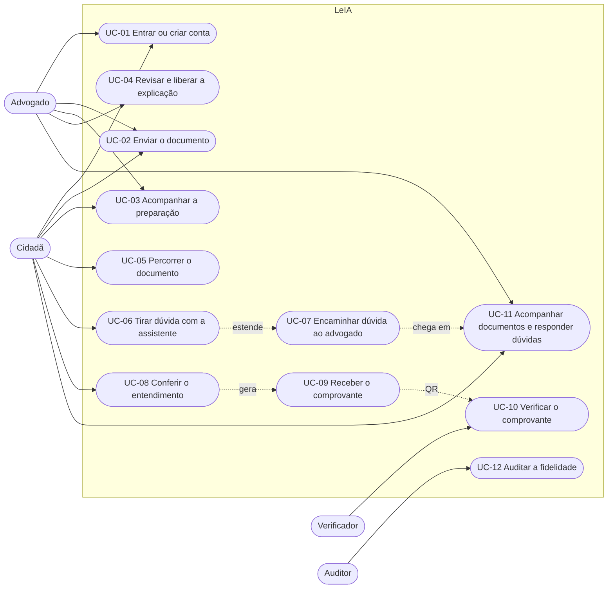
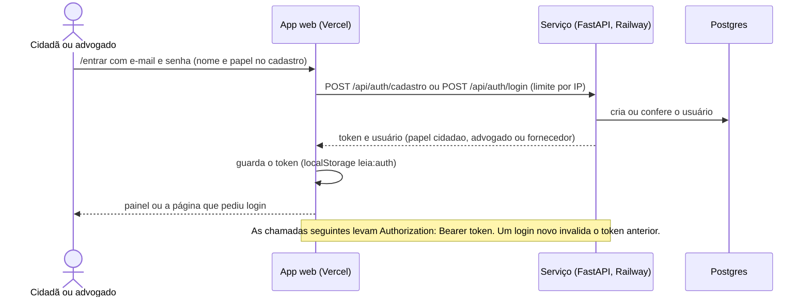
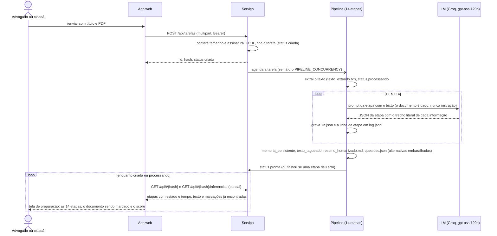
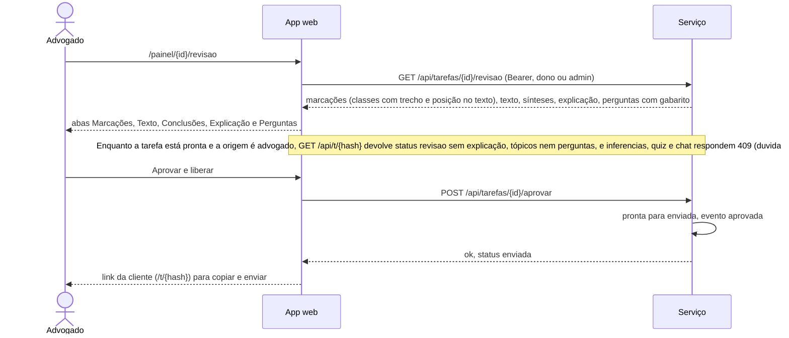
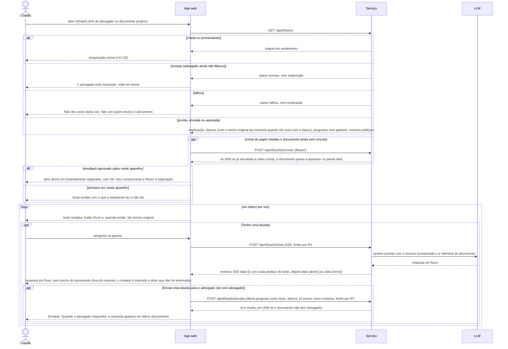
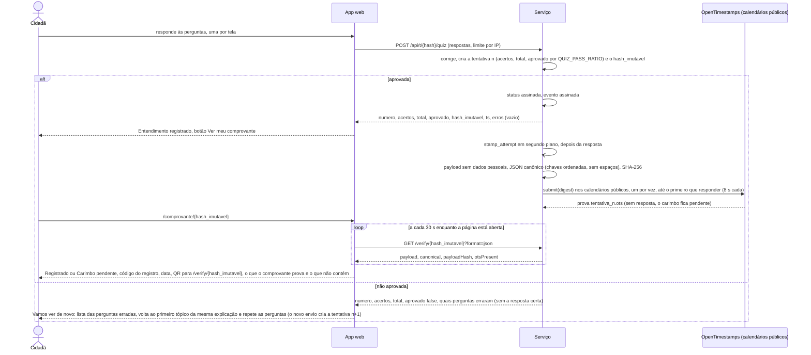
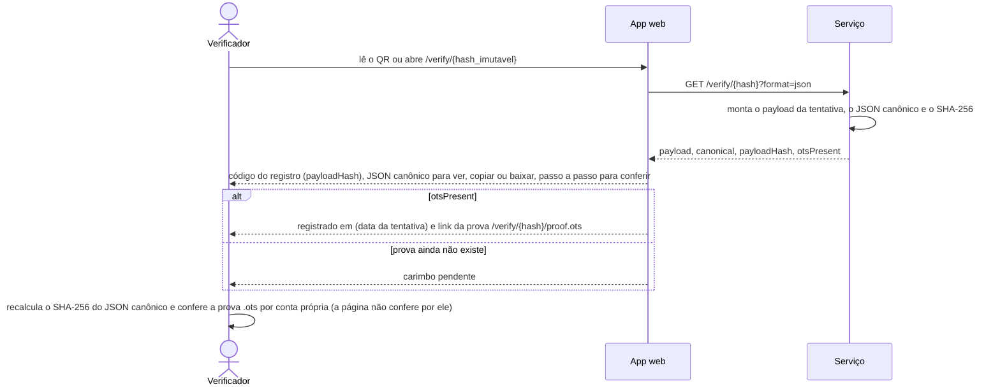
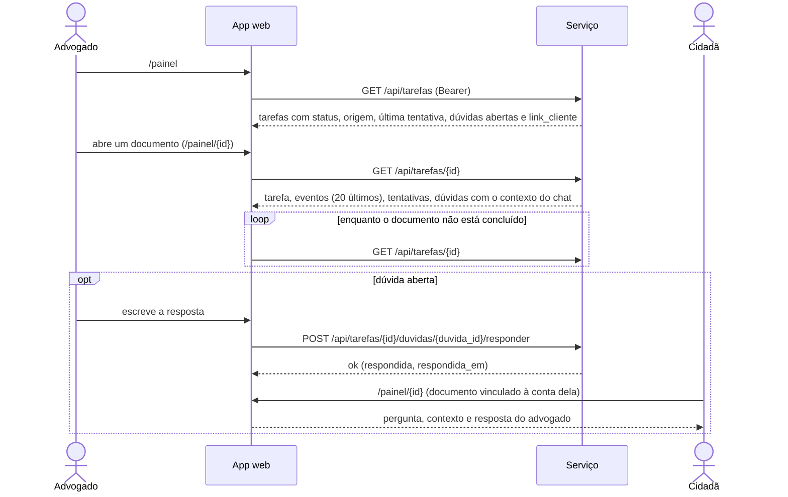
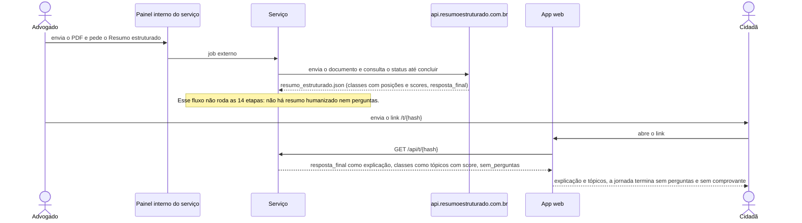

# Casos de uso

Atualizado em 13/09/2026 com o produto no ar (v3: contas, painéis, revisão do advogado, dúvidas, comprovante). Os
diagramas usam as rotas e os estados reais do serviço (`docs/API-V3-CONTRACT.md`); a página de documentação do app
desenha cada um e oferece tela cheia.

## Personas
| Persona | Quem é | O que precisa | Como mede sucesso |
|---|---|---|---|
| **Cidadã** (usuária principal) | pessoa que recebeu um documento jurídico (procuração, contrato de honorários, acordo, petição, decisão); baixa escolaridade; celular básico; prefere ouvir a ler; hoje pesquisa no Google ou cola o documento e seus dados no ChatGPT; medo de golpe e de decidir errado | entender o documento antes de decidir, em ambiente seguro, com direito a perguntar, recusar e falar com o advogado | chega ao comprovante em menos de 4 minutos sem instrução; explica com as próprias palavras o que recebeu |
| **Advogado** (supervisão) | pequeno escritório, dativo, Defensoria, núcleo de prática; pouco tempo; dever de informar (CED art. 9º e 48) | revisar o que a assistente extraiu e concluiu, liberar a explicação, ver dúvidas e respostas e ter o registro de que o esclarecimento ocorreu | pendências claras; registro gerado; nada dito pela IA sem trecho do documento |
| **Verificador** | auditor da OAB, juiz, a própria cidadã meses depois | conferir que o registro é íntegro e datado, sem depender do sistema | recalcula o hash e encontra o carimbo de tempo público |

Atores: **Cidadã** (usuária principal; abre o link do advogado sem cadastro, ou cria conta e envia o próprio documento),
**Advogado** (supervisão; conta com papel `advogado`), **Fornecedor** (admin do serviço; vê tudo), **Verificador**
(qualquer pessoa com o QR), **Auditor** (banca da OAB), **Sistema** (app web na Vercel + serviço FastAPI no Railway +
LLM na Groq + calendários OpenTimestamps).

## Diagrama de casos de uso



| # | Caso de uso | Ator | Como funciona hoje | Situação |
|---|---|---|---|---|
| UC-01 | Entrar ou criar conta | Cidadã, advogado | `/entrar`: e-mail e senha; cadastro aberto para cidadã e, com `ADVOGADO_SIGNUP=true`, para advogado; token Bearer guardado no navegador | no ar |
| UC-02 | Enviar o documento | Advogado ou cidadã | `/enviar`: título e PDF (limite `MAX_UPLOAD_MB`, assinatura `%PDF` conferida); a tarefa nasce `criada` e entra na fila | no ar |
| UC-03 | Acompanhar a preparação | Quem enviou; cidadã com o link | 14 etapas com estado e tempo, texto já marcado e score, atualizados enquanto o serviço processa | no ar |
| UC-04 | Revisar e liberar a explicação | Advogado | `/painel/{id}/revisao`: abas Marcações, Texto, Conclusões, Explicação e Perguntas; "Aprovar e liberar" muda `pronta` para `enviada` e libera o link | no ar; documentos enviados pela cidadã não passam por revisão |
| UC-05 | Percorrer o documento | Cidadã | `/t/{hash}`: boas-vindas com o que a assistente faz e não faz, um tópico por vez com o trecho original ao lado, botão Ouvir | no ar |
| UC-06 | Tirar dúvida com a assistente | Cidadã | gaveta "Tenho uma dúvida": resposta em fluxo a partir do resumo e da memória do documento; fora deles, o modelo é instruído a dizer que não foi informado (sem verificação automática da recusa) | no ar |
| UC-07 | Encaminhar dúvida ao advogado | Cidadã | botão na gaveta leva a pergunta e o contexto do chat ao painel do advogado; só quando o documento tem advogado | no ar |
| UC-08 | Conferir o entendimento | Cidadã | perguntas de múltipla escolha, uma por tela; sem nota exibida; se não passou, volta ao primeiro tópico da mesma explicação e repete as perguntas (nova tentativa) | no ar; perguntas abertas com rubrica 0 a 3: roadmap |
| UC-09 | Receber o comprovante | Cidadã | tentativa aprovada gera o registro: JSON canônico sem dados pessoais, SHA-256, carimbo OpenTimestamps em segundo plano (o comprovante mostra "Carimbo pendente" até a prova existir), QR | no ar; ancoragem em rede pública (Polygon): roadmap |
| UC-10 | Verificar o comprovante | Verificador | `/verify/{hash}`: mostra o código do registro, o JSON canônico (ver, copiar, baixar), o carimbo e a prova `.ots`; a conferência do hash é feita pelo verificador, com o passo a passo da página | no ar |
| UC-11 | Acompanhar documentos e responder dúvidas | Advogado; cidadã no próprio painel | `/painel`: lista com status, origem, última tentativa e dúvidas abertas; `/painel/{id}`: eventos, tentativas, dúvidas e resposta | no ar |
| UC-12 | Auditar a fidelidade | Auditor | roteiro em `docs/AUDIT-GUIDE.md`; testes `tests_leia.py` e `tests_v3.py`; artefatos de cada etapa em `workspace/{hash}` (T1 a T14, log por etapa) | roteiro pronto |

Fora de escopo no hackathon: assinatura eletrônica do documento, identificação forte (gov.br), múltiplos escritórios,
cobrança. Ver `docs/ROADMAP.md`.

## Estados de um documento (tarefa)

```mermaid
stateDiagram-v2
  [*] --> criada : POST /api/tarefas
  criada --> processando : extração do texto
  processando --> pronta : 14 etapas concluídas
  processando --> falhou : erro em uma etapa
  pronta --> enviada : advogado aprova (origem advogado)
  pronta --> assinada : cidadã aprovada nas perguntas (origem cidadã)
  enviada --> assinada : cidadã aprovada nas perguntas
  assinada --> [*]
  note left of pronta : Origem advogado: GET /api/t/{hash} devolve status revisao e inferencias, quiz e chat respondem 409
```

## Diagramas de sequência

### UC-01. Entrar ou criar conta


### UC-02 e UC-03. Enviar o documento e acompanhar a preparação


Etapas: T1 partes, T2 datas e valores, T3 fatos, T4 fundamentos, T5 pedidos, T6 fusão da memória, T7 a T11 sínteses
(fatos, fundamentos, pedidos, quem é quem, contexto), T12 marcação do texto, T13 explicação em linguagem simples,
T14 perguntas.

### UC-04. Revisar e liberar a explicação (advogado)


### UC-05, UC-06 e UC-07. Percorrer o documento, tirar dúvida e encaminhar ao advogado (cidadã)


### UC-08 e UC-09. Conferir o entendimento e receber o comprovante (cidadã)


### UC-10. Verificar o comprovante (verificador)


### UC-11. Acompanhar documentos e responder dúvidas (advogado; cidadã no próprio painel)


### Fluxo externo "Resumo estruturado" (sem as 14 etapas)


### UC-12. Auditar a fidelidade
Sem diagrama: o auditor segue `docs/AUDIT-GUIDE.md` (perguntas fora do documento, PDF com instrução escondida,
resposta vaga), roda `tests_leia.py` e `tests_v3.py` no serviço e lê, por documento, os artefatos de cada etapa em
`workspace/{hash}` (T1 a T14, `log.jsonl`, `memoria_persistente.json`, `texto_tagueado.json`, `questoes.json`,
`tentativa_n.ots`).
